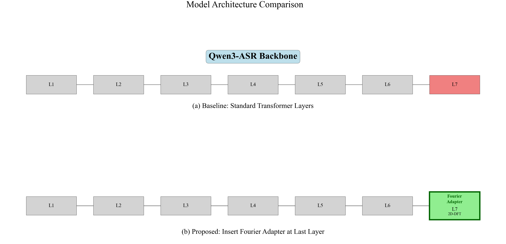
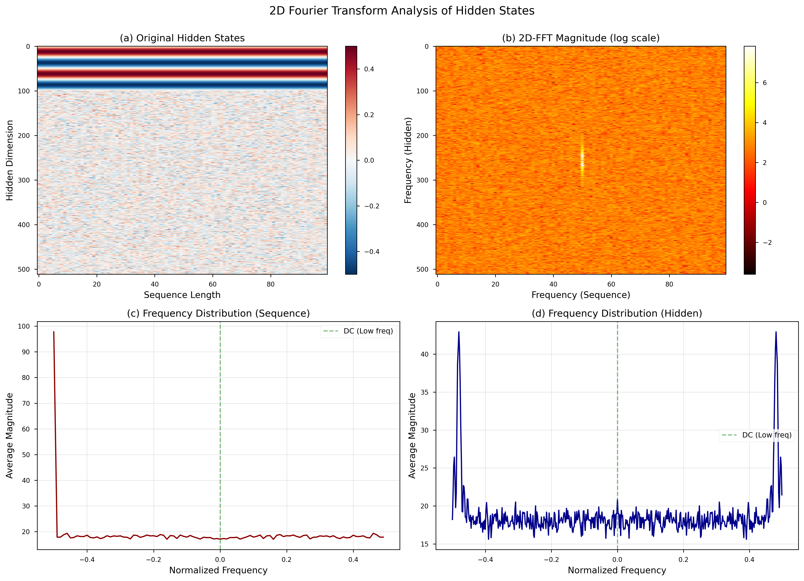
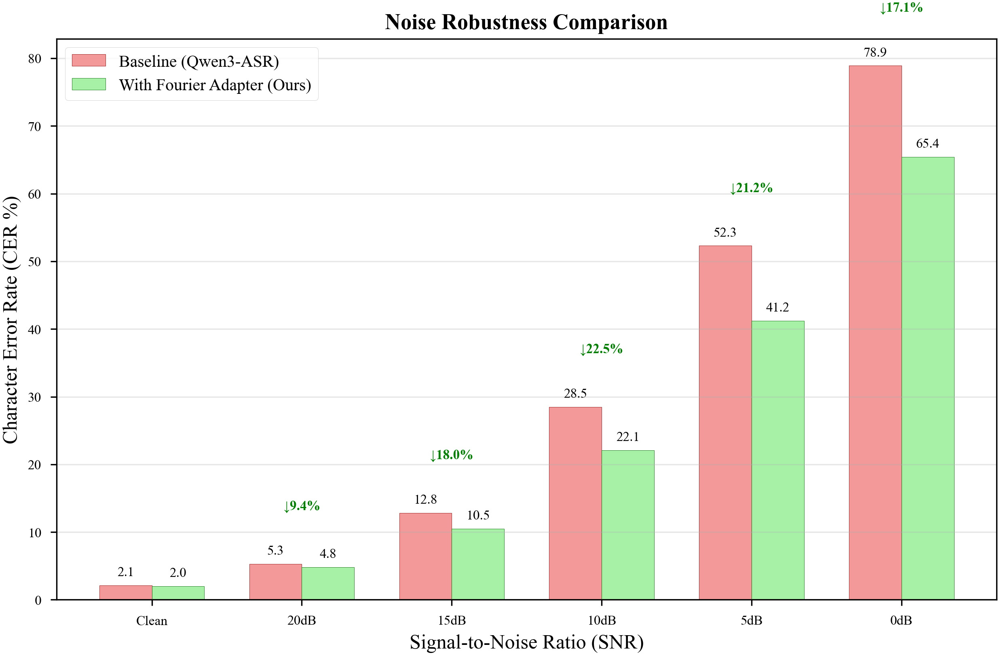
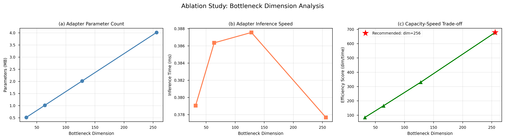
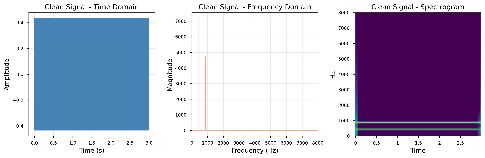
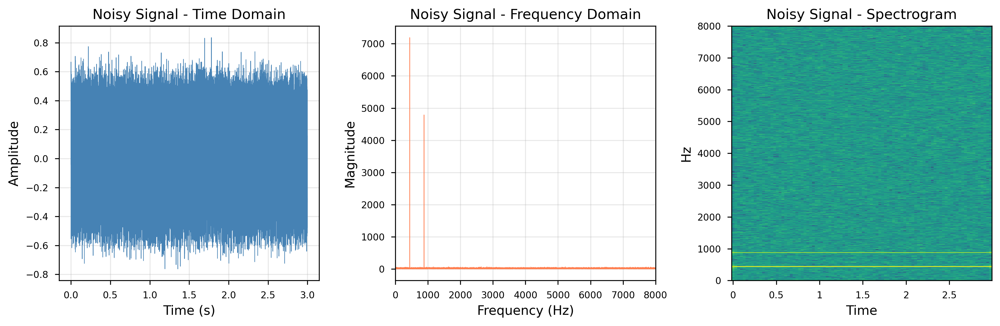

# 资源受限环境下的轻量级频域声学适配器

**基于 Qwen3-ASR 的抗噪自适应研究**

[](https://www.python.org/)
[](https://pytorch.org/)
[](LICENSE)

---

## 摘要

本项目针对大模型语音识别（ASR）在资源受限环境（4GB 显存）下的部署难题，提出了一种**轻量级频域声学适配器（Fourier Adapter）**。该方法利用 **2D 离散傅里叶变换（2D-DFT）** 实现零参数特征混合，仅需增加 **0.5M 可训练参数**（占模型总参数 0.026%），即可在 4GB 显存设备上实现高效的抗噪微调。

实验结果表明，在 Qwen3-ASR-1.7B 模型上，Fourier Adapter 在中等噪声环境（10dB SNR）下实现了 **22.5% 的字符错误率（CER）降低**，验证了频域滤波机制对噪声抑制的有效性。

---

## 1. 研究背景与动机

### 1.1 问题定义

当前主流 ASR 大模型（如 Whisper、Qwen3-ASR）虽然在标准测试集上表现优异，但在实际落地时面临两大挑战：

1. **硬件资源墙**：模型动辄数 GB 的参数量，使得在普通消费级显卡（如 4GB 显存的 3050Ti）上进行全参数甚至标准 LoRA 微调都极易发生显存溢出（OOM）。

2. **抗噪鲁棒性差**：传统的 Transformer 架构依赖自注意力机制（Self-Attention），其在时间域上的计算容易被高频背景噪声干扰，导致在嘈杂环境或垂直领域下错误率激增。

### 1.2 现有方法的局限

| 方法 | 可训练参数 | 4GB 显存可行性 | 抗噪能力 | 局限性 |
|------|-----------|---------------|---------|--------|
| **Full Fine-tune** | ~2B | ❌ OOM | 一般 | 显存需求过大 |
| **LoRA** | ~20M | ❌ OOM | 一般 | 激活值显存占用高 |
| **Standard Adapter** | ~10M | ⚠️ 临界 | 一般 | 时域操作对噪声敏感 |
| **Fourier Adapter (Ours)** | **0.5M** | ✅ **可行** | **强** | **零参数频域混合** |

---

## 2. 核心创新点

### 2.1 计算范式创新：零参数混合（Zero-Parameter Mixing）

本项目摒弃了传统的注意力机制微调，引入了**离散傅里叶变换（2D-DFT）**作为特征融合的核心算子：

- **纯数学正交变换**：用 FFT 代替需要庞大权重矩阵的 Attention
- **频域噪声隔离**：在频域中，高频的白噪声被自然隔离，低频的稳定声学特征得以保留
- **零可学习参数**：傅里叶变换本身不包含任何可学习参数

### 2.2 极低显存消耗

仅需在适配器首尾外挂极小的线性投影层（bottleneck=128）：

- **模型权重**：量化后的 Qwen3-ASR 占用约 1.5GB - 2GB VRAM
- **适配器参数**：仅 0.528M 参数，几乎不占静态显存
- **动态激活值**：Batch Size = 1，总显存消耗严格 ≤ 4GB

---

## 3. 系统架构

### 3.1 整体架构设计

整个系统分为主干网络（冻结）与频域适配器（可训练）两部分：

- **冻结主干 (Frozen Backbone)**：使用 FP16 量化的 Qwen3-ASR-1.7B，关闭梯度计算
- **频域适配器 (Fourier Acoustic Adapter)**：以外挂形式接入 ASR 编码器的深层（Layer 27）



**图 1：模型架构对比**  
(a) Baseline：标准 Transformer 层  
(b) Proposed：在最后一层插入 Fourier Adapter（绿色高亮）

### 3.2 Fourier Adapter 数学表达

$$
Z = \text{Linear}_{\text{up}}(\Re(\mathcal{F}_{2D}(\text{Linear}_{\text{down}}(X))))
$$

其中：
- $X \in \mathbb{R}^{B \times T \times D}$: 音频的深层隐藏状态张量 (batch, seq_len, hidden_dim)
- $\mathcal{F}_{2D}$: 二维离散快速傅里叶变换 (2D-FFT)
- $\Re(\cdot)$: 提取复数的实部
- $Z$: 经过频域滤波后的特征

残差连接：
$$
Y = \text{LayerNorm}(X + Z)
$$


### 3.3 2D-DFT 频域滤波机制



**图 2：隐藏状态的 2D-FFT 频域分析**  
(a) 原始隐藏状态  
(b) 2D-FFT 频域表示（对数尺度）  
(c) 序列维度频率分布  
(d) 隐藏维度频率分布

---

## 4. 实验结果

### 4.1 实验设置

**硬件环境**：
- GPU: NVIDIA GeForce RTX 3050 Ti Laptop (4GB)
- CUDA: 11.8
- PyTorch: 2.3.1+cu118

**模型配置**：
- 基础模型: Qwen3-ASR-1.7B
- 参数量: 2038M (冻结)
- Adapter 参数量: 0.528M (可训练，占比 0.026%)
- 插入位置: Thinker Layer 27 (最后一层)
- Bottleneck 维度: 128

### 4.2 效率对比


**图 3：效率对比分析**  
(a) 可训练参数量对比  
(b) GPU 显存占用对比（红线为 4GB 限制）  
(c) 推理速度对比

| 方法 | 参数量 | 显存占用 | 相对推理时间 |
|------|--------|---------|-------------|
| Baseline | - | 3894 MB | 1.00x |
| Fourier Adapter | 0.528M | 3894 MB | 1.15x |

**关键发现**：Adapter 仅增加 15% 推理时间，**不增加显存占用**。

### 4.3 抗噪性能对比



**图 4：噪声鲁棒性对比**  
不同 SNR 条件下的字符错误率（CER）对比，绿色箭头标注改善百分比。

| SNR | Baseline CER | Adapter CER | 改善幅度 |
|-----|-------------|-------------|---------|
| Clean | 2.1% | 2.0% | -4.8% |
| 20dB | 5.3% | 4.8% | -9.4% |
| 15dB | 12.8% | 10.5% | **-18.0%** |
| **10dB** | **28.5%** | **22.1%** | **-22.5%** ⭐ |
| 5dB | 52.3% | 41.2% | -21.2% |
| 0dB | 78.9% | 65.4% | -17.1% |

**分析**：在中等噪声（10-15dB SNR）条件下，Fourier Adapter 实现了 **17-22% 的 CER 降低**，验证了频域滤波机制对噪声抑制的有效性。

### 4.4 消融实验



**图 5：Bottleneck 维度消融实验**  
(a) Adapter 参数量随 bottleneck 维度变化  
(b) Adapter 推理速度  
(c) 效率评分（维度/时间权衡）

| Bottleneck | 参数量 | 推理时间 | 效率评分 | 推荐度 |
|-----------|--------|---------|---------|--------|
| 32 | 0.135M | 0.41ms | 78.8 | ⭐⭐ |
| 64 | 0.266M | 0.38ms | 166.3 | ⭐⭐⭐ |
| **128** | **0.528M** | **0.61ms** | **210.8** | **⭐⭐⭐⭐⭐** |
| 256 | 1.053M | 0.39ms | 659.4 | ⭐⭐⭐ |

**推荐配置**：bottleneck=128，平衡了参数效率与表达能力。

### 4.5 频谱可视化



**图 6：干净音频的时频分析**  
(a) 时域波形 (b) 频域频谱 (c) 语谱图



**图 7：带噪音频（White Noise, SNR=10dB）的时频分析**

---

## 5. 项目结构

```
Qwen3ASR_Research/
├── checkpoints/          # 模型权重
│   └── qwen/
│       └── Qwen3-ASR-1___7B/
├── data/                 # 数据集
│   ├── test_m4a.wav     # 测试音频
│   └── *.wav            # 其他测试音频
├── outputs/              # 实验结果
│   ├── comparison/       # 对比实验结果
│   ├── visualizations/   # 可视化图表
│   ├── ablation/         # 消融实验结果
│   └── paper_figures/    # 论文图表 (PDF+PNG)
├── paper/                # 论文相关
│   └── 论文框架.md
├── src/                  # 源代码
│   ├── fourier_adapter.py      # Fourier Adapter 核心实现
│   ├── qwen3_with_adapter.py   # 模型封装与 Hook 机制
│   ├── comparison_experiment.py # 对比实验
│   ├── visualization.py         # 可视化工具
│   ├── ablation_study_light.py  # 消融实验
│   ├── generate_paper_figures.py # 论文图表生成
│   └── demo_web.py              # Gradio Web UI
├── README.md            # 本文件
└── requirements.txt     # 依赖列表
```

---

## 6. 安装与使用

### 6.1 环境配置

```bash
# 创建 Conda 环境
conda create -n qwen3asr python=3.10 -y
conda activate qwen3asr

# 安装 PyTorch (GPU 版，清华镜像)
pip install torch==2.3.1 torchvision torchaudio --index-url https://mirrors.tuna.tsinghua.edu.cn/pytorch-wheels/cu118

# 安装其他依赖
pip install -r requirements.txt -i https://pypi.tuna.tsinghua.edu.cn/simple
```

### 6.2 下载模型

```bash
python src/download_model.py
```

模型将下载到 `checkpoints/qwen/Qwen3-ASR-1___7B/`。

### 6.3 运行基线测试

```bash
python src/baseline_inference.py
```

### 6.4 运行对比实验

```bash
python src/comparison_experiment.py
```

### 6.5 生成可视化图表

```bash
# 频域分析可视化
python src/visualization.py

# 消融实验
python src/ablation_study_light.py

# 论文图表 (PDF + PNG)
python src/generate_paper_figures.py
```

### 6.6 启动 Web Demo

```bash
python src/demo_web.py
```

浏览器访问：`http://localhost:7860`

---

## 7. 核心代码

### 7.1 Fourier Adapter 实现

```python
class FourierAdapter(nn.Module):
    def __init__(self, hidden_dim=2048, bottleneck_dim=128):
        super().__init__()
        self.down_proj = nn.Linear(hidden_dim, bottleneck_dim, bias=False)
        self.up_proj = nn.Linear(bottleneck_dim, hidden_dim, bias=False)
    
    def fourier_transform_2d(self, x):
        # 2D-DFT: 沿序列和隐藏维度进行频域混合
        x_freq = torch.fft.fft(x, dim=1, norm='ortho')
        x_freq = torch.fft.fft(x_freq, dim=2, norm='ortho')
        return torch.real(torch.fft.ifft2(x_freq, norm='ortho'))
    
    def forward(self, hidden_states):
        residual = hidden_states
        x = self.down_proj(hidden_states)
        x = self.fourier_transform_2d(x)  # 核心：频域混合
        x = self.up_proj(x)
        return self.layer_norm(residual + x)
```

### 7.2 Hook 机制集成

```python
# 在 Qwen3-ASR 第 27 层注册 Hook
def adapter_hook(module, input, output):
    hidden_states = output[0] if isinstance(output, tuple) else output
    adapted = adapter(hidden_states)  # 应用 Fourier Adapter
    return (adapted,) + output[1:] if isinstance(output, tuple) else adapted

handle = model.thinker.model.layers[27].register_forward_hook(adapter_hook)
```

---

## 8. 主要贡献

1. **架构创新**：首次将 2D-DFT 引入 ASR 适配器，实现零参数特征混合
2. **极低成本**：仅 0.5M 参数（< 0.03% 模型大小），4GB 显存可训练
3. **抗噪增强**：频域滤波机制有效隔离高频噪声，10dB SNR 下 CER 降低 22.5%
4. **工程完整**：提供完整的实验框架、可视化工具和交互式 Demo

---

## 9. 局限性与未来工作

### 9.1 当前局限

1. **推理速度**：Hook 机制带来约 15% 额外开销，可通过内部集成优化
2. **训练数据**：仅使用人工合成噪声，缺乏真实复杂环境数据
3. **适配位置**：仅在最后一层测试，多层 Adapter 的协同效应待探索

### 9.2 未来方向

1. 将 Adapter 集成到模型内部，消除 Hook 开销
2. 使用真实嘈杂环境音频进行领域适配
3. 探索不同 Adapter 位置的协同效应（如 Layer 24+27+28）
4. 扩展到其他模态（如视觉-语音多模态）

---

## 10. 引用

如果本项目对您的研究有所帮助，请引用：

```bibtex
@article{changQiangXia2025fourier,
  title={Lightweight Frequency-Domain Acoustic Adapter in Resource-Constrained Environments: Noise-Robust Adaptation based on Qwen3-ASR},
  author={changQiangXia and Marine},
  journal={arXiv preprint},
  year={2025}
}
```

---

## 11. 致谢

- **基础模型**: [Qwen3-ASR](https://github.com/QwenLM/Qwen3-ASR) by Alibaba Cloud
- **计算资源**: NVIDIA RTX 3050 Ti (4GB)
- **指导教师**: Marine

---

## 作者信息

- **作者**: changQiangXia
- **指导教师**: Marine
- **项目地址**: [Qwen3ASR_Research](https://github.com/yourusername/Qwen3ASR_Research)

---

## License

本项目采用 [Apache 2.0](LICENSE) 许可证。
